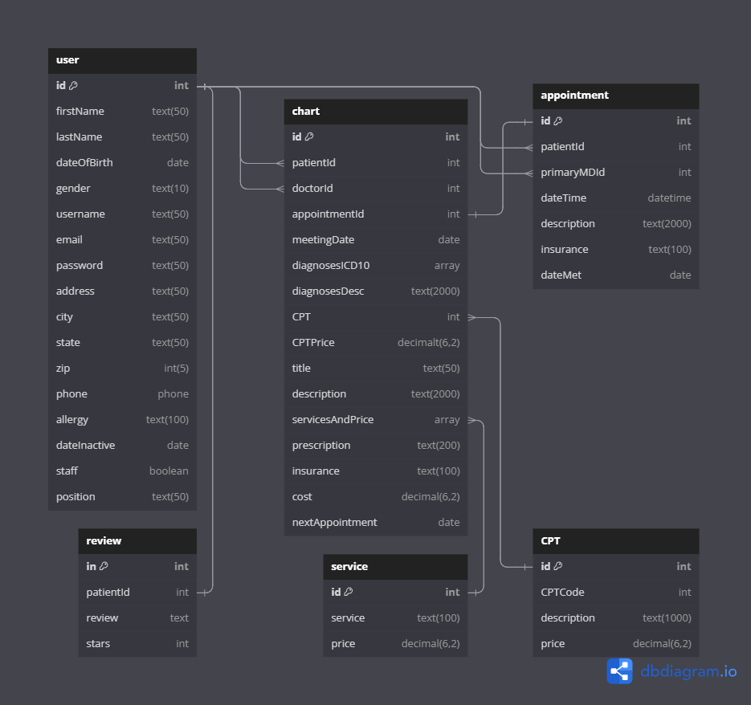

# Grace Clinic

## Full Stack React, Redux-Toolkit, Express, Sqlite3/PostgreSQL

## Introduction

This is a full-stack built with React, Redux-Toolkit, Express, Sqlite3/PostgreSQL. The application features user authentication, which allows users to login, sign-up, logout, and use a demo user login for easy access. This application also includes 5 major CRUD features with 1 partial and yet can be full CRUD but related to another table in deletion:

1. User
2. Review
3. Service
4. CPT
5. Appointment
6. Chart table will have Create, Read, Update and Delete in relation to the User

## Getting started

1. Clone this repository (only this branch).

2. Install dependencies.

   ```bash
   
   ```

3. Create a **.env** file based on the example with proper settings for your
   development environment.

4. Make sure the SQLite3 database connection URL is in the **.env** file.

5. This starter organizes all tables inside the `flask_schema` schema, defined
   by the `SCHEMA` environment variable. Replace the value for
   `SCHEMA` with a unique name, **making sure you use the snake_case
   convention.**

6. Get into your :

   ```bash
   
   ```

   ```bash
 
   ```

   ```bash
   
   ```

   ```bash
 
   ```

   ```bash
 
   ```

7. The React frontend has no styling applied. Copy the **.css** files from your
   Authenticate Me project into the corresponding locations in the
   **react-vite** folder to give your project a unique look.

8. To run the React frontend in development, `cd` into the **react-vite**
   directory and run `npm i` to install dependencies. Next, run `npm run build`
   to create the `dist` folder. The starter has modified the `npm run build`
   command to include the `--watch` flag. This flag will rebuild the **dist**
   folder whenever you change your code, keeping the production version up to
   date.

## Deployment through Render.com

First, recall that Vite is a development dependency, so it will not be used in
production. This means that you must already have the **dist** folder located in
the root of your **react-vite** folder when you push to GitHub. This **dist**
folder contains your React code and all necessary dependencies minified and
bundled into a smaller footprint, ready to be served from your Python API.

Begin deployment by running `npm run build` in your **react-vite** folder and
pushing any changes to GitHub.

Refer to your Render.com deployment articles for more detailed instructions
about getting started with [Render.com], creating a production database, and
deployment debugging tips.

From the Render [Dashboard], click on the "New +" button in the navigation bar,
and click on "Web Service" to create the application that will be deployed.

Select that you want to "Build and deploy from a Git repository" and click
"Next". On the next page, find the name of the application repo you want to
deploy and click the "Connect" button to the right of the name.

Now you need to fill out the form to configure your app. Most of the setup will
be handled by the **Dockerfile**, but you do need to fill in a few fields.

Start by giving your application a name.

Make sure the Region is set to the location closest to you, the Branch is set to
"main", and Runtime is set to "Docker". You can leave the Root Directory field
blank. (By default, Render will run commands from the root directory.)

Select "Free" as your Instance Type.

### Add environment variables

In the development environment, you have been securing your environment
variables in a **.env** file, which has been removed from source control (i.e.,
the file is gitignored). In this step, you will need to input the keys and
values for the environment variables you need for production into the Render
GUI.

Add the following keys and values in the Render GUI form:

- SECRET_KEY (click "Generate" to generate a secure secret for production)
- FLASK_ENV production
- FLASK_APP app
- SCHEMA=«custom_schema_name_here»


In a new tab, navigate to your dashboard and click on your Postgres database
instance.

Add the following keys and values:

- DATABASE_URL (copy value from the **External Database URL** field)

Assign PORT to 8000, choose a custom schema in snake case, and generate a strong JWT secret.

- Recommendation to generate a strong secret: create a random string using openssl (a library that should already be installed in your Ubuntu/MacOS shell). Run openssl rand -base64 to generate a random JWT secret.

**Note:** Add any other keys and values that may be present in your local
**.env** file. As you work to further develop your project, you may need to add
more environment variables to your local **.env** file. Make sure you add these
environment variables to the Render GUI as well for the next deployment.

### Deploy

Now you are finally ready to deploy! Click "Create Web Service" to deploy your
project. The deployment process will likely take about 10-15 minutes if
everything works as expected. You can monitor the logs to see your Dockerfile
commands being executed and any errors that occur.

When deployment is complete, open your deployed site and check to see that you
have successfully deployed your Flask application to Render! You can find the
URL for your site just below the name of the Web Service at the top of the page.

**Note:** By default, Render will set Auto-Deploy for your project to true. This
setting will cause Render to re-deploy your application every time you push to
main, always keeping it up to date.

[Render.com]: https://render.com/
[Dashboard]: https://dashboard.render.com/

## Database Schema Design



## API Documentation

## STAFF / CLIENT AUTHENTICATION OR AUTHORIZATION

### All endpoints that require authentication

All endpoints that require a current staff/client to be logged in.

- Request: endpoints that require authentication
- Error Response: Require authentication

  - Status Code: 401
  - Headers:
    - content-Type: application/json
  - Body:

  ```json
  {
    "message": "Authentication required"
  }
  ```

### All endpoints that require proper authorization

All endpoints that require authentication and the current staff / client does not have the correct role(s) or permission(s).

- Request: endpoints that require proper authorization
- Error Response: Require proper authorization

  - Status Code: 403
  - Headers:
    - Content-Type: application/json
  - Body:

  ```json
  {
    "message": "Forbidden"
  }
  ```

### Get the Current User

Returns the information about the current Staff or Client that is logged in.

- Require Authentication: false
- Request:

  - Method: GET
  - Route path: /api/session
  - Body: none

- Successful Response when there is a logged in Staff

  - Status Code: 200
  - Headers:
    - Content-Type: application/json
  - Body:

  ```json
  {
    "user": {
      "id": 1,
      "firstName": "John",
      "lastName": "Smith",
      "dateOfBirth": 1970-04-30,
      "gender": "male",
      "username": "johnsmith",
      "email": "john.smith@example.com",
      "password": "password1",
      "address": "123 main st",
      "city": "redlands",
      "state": "CA",
      "zip": 92323,
      "phone": 909-555-1234,
      "allergy": null,
      "dateInactive": null,
      "staff": true,
      "position": "manager"
    }
  }
  ```

- Successful Response when there is a logged in Client

  - Status Code: 200
  - Headers:
    - Content-Type: application/json
  - Body:

  ```json
  {
    "user": {
      "id": 2,
      "firstName": "Sam",
      "lastName": "Malone",
      "dateOfBirth": 1970-04-30,
      "gender": "male",
      "username": "sammalone",
      "email": "sam.malone@example.com",
      "password": "password1",
      "address": "123 city st",
      "city": "highland",
      "state": "CA",
      "zip": 92345,
      "phone": 909-555-2345,
      "allergy": "ibuprofen",
      "dateInactive": null,
      "staff": false,
      "position": null
    }
  }
  ```

- Successful Response when there is no logged in user

  - Status Code: 200
  - Headers:
    - Content-Type: application/json
  - Body:

    ```json
    {
      "user": null
    }
    ```

### Log In a User

Logs in a current user with valid credentials and returns the current user's
information.

- Require Authentication: false
- Request

  - Method: POST
  - Route path: /api/session
  - Headers:
    - Content-Type: application/json
  - Body:

    ```json
    {
      "credential": "john.smith@gmail.com",     // or "johnsmith" as username
      "password": "password1"
    }
    ```

- Successful Response

  - Status Code: 200
  - Headers:
    - Content-Type: application/json
  - Body:

    ```json
    {
      "user": {
        "id": 1,
        "firstName": "John",
        "lastName": "Smith",
        "email": "john.smith@gmail.com",
        "username": "JohnSmith",
        "staff": true, // for client will be false
        "position": "Manager" // for client will be null
      }
    }
    ```

- Error Response: Invalid credentials

  - Status Code: 401
  - Headers:
    - Content-Type: application/json
  - Body:

    ```json
    {
      "message": "Invalid credentials"
    }
    ```

- Error response: Body validation errors

  - Status Code: 400
  - Headers:
    - Content-Type: application/json
  - Body:

    ```json
    {
      "message": "Bad Request",
      "errors": {
        "credential": "Email or username is required",
        "password": "Password is required"
      }
    }
    ```

### Sign Up a User

Creates a new Client, logs them in as the current Client, and returns the current
Client's information.

- Require Authentication: false
- Request

  - Method: POST
  - Route path: /api/users
  - Headers:
    - Content-Type: application/json
  - Body:

    ```json
    {
      "id": 1,
      "firstName": "John",
      "lastName": "Smith",
      "dateOfBirth": 1970-04-30,
      "gender": "male",
      "username": "johnsmith",
      "email": "john.smith@example.com",
      "password": "password1",
      "address": "123 main st",
      "city": "redlands",
      "state": "CA",
      "zip": 92323,
      "phone": 909-555-1234,
      "allergy": null,
      "dateInactive": null,
      "staff": true,
      "position": "manager"
    }
    ```

- Successful Response

  - Status Code: 201
  - Headers:
    - Content-Type: application/json
  - Body:

    ```json
    {
      "user": {
        "id": 1,
        "firstName": "John",
        "lastName": "Smith",
        "dateOfBirth": 1970-04-30,
        "gender": "male",
        "username": "johnsmith",
        "email": "john.smith@example.com",
        "password": "password1",
        "address": "123 main st",
        "city": "redlands",
        "state": "CA",
        "zip": 92323,
        "phone": 909-555-1234,
        "allergy": null,
        "dateInactive": null,
        "staff": true,          // if client: null
        "position": "manager"   // if client: null
      }
    }
    ```

- Error response: Staff already exists with the specified email or username

  - Status Code: 500
  - Headers:
    - Content-Type: application/json
  - Body:

    ```json
    {
      "message": "User already exists",
      "errors": {
        "email": "User with that email already exists",
        "username": "User with that username already exists"
      }
    }
    ```

- Error response: Body validation errors

  - Status Code: 400
  - Headers:
    - Content-Type: application/json
  - Body:

    ```json
    {
      "message": "Bad Request",
      "errors": {
        "firstName": "required",
        "lastName": "required",
        "dateOfBirth": "required",
        "gender": "required",
        "username": "required",
        "email": "required",
        "password": "required",
        "address": "required",
        "city": "required",
        "state": "required",
        "zip": "required",
        "phone": "required"
      }
    }
    ```

### Delete a User

Deletes an existing User - this is only can be done by the Manager and if dateInactive < 5 years

- Require Authentication: true
- Require proper authorization: Pet must belong to the current user, or staff member
- Request

  - Method: DELETE
  - Route path: /api/users/:userId
  - Body: none

- Successful Response

  - Status Code: 200
  - Headers:
    - Content-Type: application/json
  - Body:

    ```json
    {
      "message": "Successfully deleted"
    }

    the deletion will cascade delete the Charting table
    ```

## SERVICE

### Get all Services

Returns all the services.

- Require Authentication: false
- Request

  - Method: GET
  - Route path: /api/services
  - Body: none

- Successful Response

  - Status Code: 200
  - Headers:
    - Content-Type: application/json
  - Body:

    ```json
    {
      "Services": [
        {
          "id": 1,
          "service": "blood work",
          "price": 200
        },
        {
          "id": 2,
          "service": "X Ray",
          "price": 300
        }
      ]
    }
    ```

### Get a Service based on id

Returns a service based on id.

- Require Authentication: false
- Request

  - Method: GET
  - Route path: /api/services/:serviceId
  - Body: none

- Successful Response

  - Status Code: 200
  - Headers:
    - Content-Type: application/json
  - Body:

    ```json
    {
      "id": 2,
      "service": "X Ray",
      "price": 300
    }
    ```

### Create a Service

Creates and returns a new service,

- Require Authentication: Owner or manager only
- Request

  - Method: POST
  - Route path: /api/services
  - Body:

  ```json
  {
    "service": "X Ray",
    "price": 300
  }
  ```

- Successful Response

  - Status Code: 200
  - Headers:
    - Content-Type: application/json
  - Body:

  ```json
  {
    "id": 2,
    "service": "X Ray",
    "price": 300
  }
  ```

- Error Response: Body validation errors

- Status Code: 400
- Headers:
  - Content-Type: application/json
- Body:

  ```json
  {
    "message": "Bad Request",
    "errors": {
      "service": "required",
      "price": "must be positive integer"
    }
  }
  ```

### Edit a Service

Updates and returns an existing service.

- Require Authentication: true
- Require proper authorization: Owner or manager must be signed in to edit
- Request

  - Method: Put
  - Route path: /api/services/:serviceId
  - Headers:
    - Content-Type: application/json
  - Body:

    ```json
    {
      "service": "X Ray",
      "price": 300
    }
    ```

- Successful Response

  - Status Code: 200
  - Headers:
    - Content-Type: application/json
  - Body:

    ```json
    {
      "id": 2,
      "service": "X Ray",
      "price": 300
    }
    ```

- Error Response: Body validation errors

  - Status Code: 400
  - Headers:
    - Content-Type: application/json
  - Body:

    ```json
    {
      "message": "Bad Request",
      "errors": {
        "service": "required",
        "price": "must be positive integer"
      }
    }
    ```

- Error response: Couldn't find a Service with the specified id

  - Status Code: 404
  - Headers:
    - Content-Type: application/json
  - Body:

    ```json
    {
      "message": "Service couldn't be found"
    }
    ```

### Delete a Service

Deletes an existing service.

- Require Authentication: true
- Require proper authorization: Owner or manager must be signed in
- Request

  - Method: DELETE
  - Route path: /api/services/:serviceId
  - Body: none

- Successful Response

  - Status Code: 200
  - Headers:
    - Content-Type: application/json
  - Body:

    ```json
    {
      "message": "Successfully deleted"
    }
    ```

- Error response: Couldn't find a Service with the specified id

  - Status Code: 404
  - Headers:
    - Content-Type: application/json
  - Body:

    ```json
    {
      "message": "Service couldn't be found"
    }
    ```

## Reviews

### Get all Reviews by current user

Returns all the reviews written by the current user.

- Require Authentication: true
- Request

  - Method: GET
  - Route path: /api/reviews
  - Body: none

- Successful Response

  - Status Code: 200
  - Headers:
    - Content-Type: application/json
  - Body:

    ```json
    {
      "Reviews": [
        {
          "id": 1,
          "patientId": 1,
          "review": "This was an awesome service!",
          "stars": 5,
          "createdAt": "2021-11-19 20:39:36",
          "updatedAt": "2021-11-19 20:39:36"
        }
      ]
    }
    ```

### Create a review

Create and return a new review.

- Require Authentication: true
- Request

  - Method: POST
  - Route path: /api/reviews/
  - Headers:
    - Content-Type: application/json
  - Body:

    ```json
    {
      "review": "This was an awesome service!",
      "stars": 5
    }
    ```

- Successful Response

  - Status Code: 201
  - Headers:
    - Content-Type: application/json
  - Body:

    ```json
    {
      "id": 1,
      "patientId": 1,
      "review": "This was an awesome service!",
      "stars": 5,
      "createdAt": "2021-11-19 20:39:36",
      "updatedAt": "2021-11-19 20:39:36"
    }
    ```

- Error Response: Body validation errors

  - Status Code: 400
  - Headers:
    - Content-Type: application/json
  - Body:

    ```json
    {
      "message": "Bad Request",
      "errors": {
        "review": "Review text is required",
        "stars": "Stars must be an integer from 1 to 5"
      }
    }
    ```

- Error response: Review from the current user already exists

  - Status Code: 500
  - Headers:
    - Content-Type: application/json
  - Body:

    ```json
    {
      "message": "User already has a review"
    }
    ```

### Edit a Review

Update and return an existing review.

- Require Authentication: true
- Require proper authorization: Review must belong to the current user
- Request

- Method: PUT
- Route path: /api/reviews/:reviewId
- Headers:
  - Content-Type: application/json
- Body:

  ```json
  {
    "review": "This was an awesome service!",
    "paws": 5
  }
  ```

- Successful Response

- Status Code: 200
- Headers:
  - Content-Type: application/json
- Body:

  ```json
  {
    "id": 1,
    "patientId": 1,
    "review": "This was an awesome service!",
    "paws": 5,
    "createdAt": "2021-11-19 20:39:36",
    "updatedAt": "2021-11-20 10:06:40"
  }
  ```

- Error Response: Body validation errors

- Status Code: 400
- Headers:
  - Content-Type: application/json
- Body:

  ```json
  {
    "message": "Bad Request",
    "errors": {
      "review": "Review text is required",
      "stars": "Stars must be an integer from 1 to 5"
    }
  }
  ```

- Error response: Couldn't find a Review with the specified id

- Status Code: 404
- Headers:
  - Content-Type: application/json
- Body:

  ```json
  {
    "message": "Review couldn't be found"
  }
  ```

### Delete a Review

Delete an existing review.

- Require Authentication: true
- Require proper authorization: Current user must be the owner of the review or a staff member
- Request

- Method: DELETE
- Route path: /api/reviews/:reviewId
- Body: none

- Successful Response

- Status Code: 200
- Headers:
  - Content-Type: application/json
- Body:

  ```json
  {
    "message": "Successfully deleted"
  }
  ```

- Error response: Couldn't find a Review with the specified id

- Status Code: 404
- Headers:
  - Content-Type: application/json
- Body:

  ```json
  {
    "message": "Review couldn't be found"
  }
  ```

## Appointments

### Get all appointments for today or a date - by Staff

- Require authentication: True for Staff
- Request:

  - Method: GET
  - Route path: /api/appointments/:date
  - Body: none

- Successful Response

  - Status Code: 200
  - Headers:
    - Content-Type: application/json
  - Body:

  ```json
  {
    "Date's Appointments": [
      {
        "dateTime": "2024-12-10 08:00:00",
        "patientId": 1,
        "primaryMDId": 2,
        "description": "abc",
        "insurance": "united",
        "dateMet": null
      }
    ]
  }

  order by primaryMDId and dateTime
  ```

### Get all appointments by Manager

- Require authentication: True for Manager
- Request:

  - Method: GET
  - Route path: /api/appointments/all
  - Body: none

- Successful Response

  - Status Code: 200
  - Headers:
    - Content-Type: application/json
  - Body:

  ```json
  {
    "Date's Appointments": [
      {
        "dateTime": "2024-12-10 08:00:00",
        "patientId": 1,
        "primaryMDId": 2,
        "description": "abc",
        "insurance": "united",
        "dateMet": null
      }
    ]
  }

  order by primaryMDId and dateTime
  ```


### Create an Appointment based on a Patient id

Create and return a new booking for a pet based on their id.

- Require Authentication: true
- Require proper authorization: current user must be the owner of the pet or a staff member
- Request

  - Method: POST
  - Route path: /api/appointments/:patientId
  - Headers:
    - Content-Type: application/json
  - Body:

    ```json
    {
      "dateTime": "2024-12-10 08:00:00",
      "patientId": 1,
      "primaryMDId": 2,
      "description": "abc",
      "insurance": "united",
      "dateMet": null
    }
    ```

- Successful Response

  - Status Code: 201
  - Headers:
    - Content-Type: application/json
  - Body:

    ```json
    {
      "dateTime": "2024-12-10 08:00:00",
      "patientId": 1,
      "primaryMDId": 2,
      "description": "abc",
      "insurance": "united",
      "dateMet": null
    }
    ```

- Error response: Body validation errors

  - Status Code: 400
  - Headers:
    - Content-Type: application/json
  - Body:

    ```json
    {
      "message": "Bad Request", //these are the only errors we can have since we'll have selectors for them to choose from
      "errors": {
        "dateTime": "require a date and time",
        "primaryMDId": "require a doctor",
        "description": "require a complaint",
        "insurance": "require an insurance",
      }
    }
    ```

- Error response: Appointment conflict

  - Status Code: 403
  - Headers:
    - Content-Type: application/json
  - Body:

    ```json
    {
      "message": "Sorry, the date, time and doctor already have appointment",
      "errors": {
        "dateTime": "choose different date or time",
        "primaryMDId": "choose different doctor",
      }
    }
    ```

### Edit a Booking

Update and return an existing booking.

- Require Authentication: true
- Require proper authorization: Booking must belong to the current user or a staff
- Request

  - Method: PUT
  - Route path: /api/appointments/:appointmentId
  - Headers:
    - Content-Type: application/json
  - Body:

    ```json
    {
      "dateTime": "2024-12-10 08:00:00",
      "primaryMDId": 2,
      "description": "abc",
      "insurance": "united",
    }
    ```

- Successful Response

  - Status Code: 200
  - Headers:
    - Content-Type: application/json
  - Body:

    ```json
    {
      "dateTime": "2024-12-10 08:00:00",
      "primaryMDId": 2,
      "description": "abc",
      "insurance": "united",
    }
    ```

- Error response: Can't edit a appointments that's on the past

  - Status Code: 403
  - Headers:
    - Content-Type: application/json
  - Body:

    ```json
    {
      "message": "Past Appointments can't be modified"
    }
    ```

### Delete a Booking

Delete an existing booking.

- Require Authentication: true
- Require proper authorization: Current user must be the one who booked or must be a staff member
- Request

  - Method: DELETE
  - Route path: /appointments/:appointmentId
  - Body: none

- Successful Response

  - Status Code: 200
  - Headers:
    - Content-Type: application/json
  - Body:

    ```json
    {
      "message": "Successfully deleted"
    }
    ```

- Error response: Couldn't find a Booking with the specified id

  - Status Code: 404
  - Headers:
    - Content-Type: application/json
  - Body:

    ```json
    {
      "message": "Appointment couldn't be found"
    }
    ```

- Error response: Appointment that have been started can't be deleted

  - Status Code: 403
  - Headers:
    - Content-Type: application/json
  - Body:

    ```json
    {
      "message": "Appointment that have been started can't be deleted"
    }
    ```

### Get all of the Current User's Appointments

Return all the bookings that the current user has made.

- Require Authentication: true
- Request

  - Method: GET
  - Route path: /session/appointments
  - Body: none

- Successful Response

  - Status Code: 200
  - Headers:
    - Content-Type: application/json
  - Body:

    ```json
    {
      "Appointments": [
        {
          "dateTime": "2024-12-10 08:00:00",
          "patientId": 1,
          "primaryMDId": 2,
          "description": "abc",
          "insurance": "united",
          "dateMet": null
        }
      ]
    }
    ```

## CPT

### Get all CPT

Returns all the services.

- Require Authentication: false
- Request

  - Method: GET
  - Route path: /api/cpt
  - Body: none

- Successful Response

  - Status Code: 200
  - Headers:
    - Content-Type: application/json
  - Body:

    ```json
    {
      "CPT": [
        {
          "id": 1,
          "CPTCode": 99211,
          "description": "established patient less than 10 minutes",
          "price": 100
        },
        {
          "id": 2,
          "CPTCode": 99212,
          "description": "established patient 10 to 19 minutes",
          "price": 150
        }
      ]
    }
    ```

### Get a Service based on id

Returns a service based on id.

- Require Authentication: false
- Request

  - Method: GET
  - Route path: /api/cpt/:cptId
  - Body: none

- Successful Response

  - Status Code: 200
  - Headers:
    - Content-Type: application/json
  - Body:

    ```json
    {
      "id": 2,
      "CPTCode": 99212,
      "description": "established patient 10 to 19 minutes",
      "price": 150
    }
    ```

### Create a Service

Creates and returns a new service,

- Require Authentication: Owner or manager only
- Request

  - Method: POST
  - Route path: /api/cpt
  - Body:

  ```json
  {
    "CPTCode": 99212,
    "description": "established patient 10 to 19 minutes",
    "price": 150
  }
  ```

- Successful Response

  - Status Code: 200
  - Headers:
    - Content-Type: application/json
  - Body:

  ```json
  {
    "id": 2,
    "CPTCode": 99212,
    "description": "established patient 10 to 19 minutes",
    "price": 150
  }
  ```

- Error Response: Body validation errors

- Status Code: 400
- Headers:
  - Content-Type: application/json
- Body:

  ```json
  {
    "message": "Bad Request",
    "errors": {
      "CPTCode": "required",
      "description": "required",
      "price": "required positive integer"
    }
  }
  ```

### Edit a Service

Updates and returns an existing service.

- Require Authentication: true
- Require proper authorization: Owner or manager must be signed in to edit
- Request

  - Method: Put
  - Route path: /api/cpt/:cptId
  - Headers:
    - Content-Type: application/json
  - Body:

    ```json
    {
      "CPTCode": 99212,
      "description": "established patient 10 to 19 minutes",
      "price": 150
    }
    ```

- Successful Response

  - Status Code: 200
  - Headers:
    - Content-Type: application/json
  - Body:

    ```json
    {
      "id": 2,
      "CPTCode": 99212,
      "description": "established patient 10 to 19 minutes",
      "price": 150
    }
    ```

- Error Response: Body validation errors

  - Status Code: 400
  - Headers:
    - Content-Type: application/json
  - Body:

    ```json
    {
      "message": "Bad Request",
      "errors": {
        "CPTCode": "required",
        "description": "required",
        "price": "required positive integer"
      }
    }
    ```

- Error response: Couldn't find the CPTCode with the specified id

  - Status Code: 404
  - Headers:
    - Content-Type: application/json
  - Body:

    ```json
    {
      "message": "CPT Code couldn't be found"
    }
    ```

### Delete a CPT Code

Deletes an existing service.

- Require Authentication: true
- Require proper authorization: Owner or manager must be signed in
- Request

  - Method: DELETE
  - Route path: /api/cpt/:cptId
  - Body: none

- Successful Response

  - Status Code: 200
  - Headers:
    - Content-Type: application/json
  - Body:

    ```json
    {
      "message": "Successfully deleted"
    }
    ```

- Error response: Couldn't find a CPT Code with the specified id

  - Status Code: 404
  - Headers:
    - Content-Type: application/json
  - Body:

    ```json
    {
      "message": "CPT Code couldn't be found"
    }
    ```

## Charting

### Get all Chart

Returns all the services.

- Require Authentication: true
- Only for doctor and staff
- Request

  - Method: GET
  - Route path: /api/chart
  - Body: none

- Successful Response

  - Status Code: 200
  - Headers:
    - Content-Type: application/json
  - Body:

    ```json
    {
      "Chart": [
        {
          "id": 1,
          "patientId": 1,
          "primaryMDId": 2,
          "appointmentId": 1,
          "meetingDate": "2024-12-20",
          "diagnosesICD10": [
              "J01.01", 
              "A01.01"
            ],
          "diagnosesDesc": "abc",
          "CPT": 99212,
          "CPTPrice": 250,
          "title": "abc",
          "description": "abcdefghi",
          "servicesAndPrice": {
            "blood work": 200,
            "X Ray": 250
            },
          "prescription": "Ibuprofen 100ml",
          "insurance": "united",
          "cost": 500,
          "nextAppointment": "2025-01-20"
        }
      ]
    }
    ```

### Get a Chart based on id

Returns a Chart based on id.

- Require Authentication: true
- Only for doctor or staff
- Request

  - Method: GET
  - Route path: /api/chart/:chartId
  - Body: none

- Successful Response

  - Status Code: 200
  - Headers:
    - Content-Type: application/json
  - Body:

    ```json
    {
      "id": 1,
      "patientId": 1,
      "primaryMDId": 2,
      "appointmentId": 1,
      "meetingDate": "2024-12-20",
      "diagnosesICD10": [
          "J01.01", 
          "A01.01"
        ],
      "diagnosesDesc": "abc",
      "CPT": 99212,
      "CPTPrice": 250,
      "title": "abc",
      "description": "abcdefghi",
      "servicesAndPrice": {
        "blood work": 200,
        "X Ray": 250
        },
      "prescription": "Ibuprofen 100ml",
      "insurance": "united",
      "cost": 500,
      "nextAppointment": "2025-01-20"
    }
    ```

### Get a Chart based on current User

Returns a Chart based on current User.

- Require Authentication: true
- By current User
- Request

  - Method: GET
  - Route path: /api/session/chart
  - Body: none

- Successful Response

  - Status Code: 200
  - Headers:
    - Content-Type: application/json
  - Body:

    ```json
    {
      "id": 1,
      "patientId": 1,
      "primaryMDId": 2,
      "appointmentId": 1,
      "meetingDate": "2024-12-20",
      "diagnosesICD10": [
          "J01.01", 
          "A01.01"
        ],
      "diagnosesDesc": "abc",
      "CPT": 99212,
      "CPTPrice": 250,
      "title": "abc",
      "description": "abcdefghi",
      "servicesAndPrice": {
        "blood work": 200,
        "X Ray": 250
        },
      "prescription": "Ibuprofen 100ml",
      "insurance": "united",
      "cost": 500,
      "nextAppointment": "2025-01-20"
    }


### Create a Chart

Creates and returns a new service,

- Require Authentication: doctor
- Request

  - Method: POST
  - Route path: /api/chart
  - Body:

  ```json
  {
          "patientId": 1,
          "primaryMDId": 2,
          "appointmentId": 1,
          "meetingDate": "2024-12-20",
          "diagnosesICD10": [
              "J01.01", 
              "A01.01"
            ],
          "diagnosesDesc": "abc",
          "CPT": 99212,
          "CPTPrice": 250,
          "title": "abc",
          "description": "abcdefghi",
          "servicesAndPrice": {
            "blood work": 200,
            "X Ray": 250
            },
          "prescription": "Ibuprofen 100ml",
          "insurance": "united",
          "cost": 500,
          "nextAppointment": "2025-01-20"
  }
  ```

- Successful Response

  - Status Code: 200
  - Headers:
    - Content-Type: application/json
  - Body:

  ```json
  {
    "id": 2,
    "patientId": 1,
    "primaryMDId": 2,
    "appointmentId": 1,
    "meetingDate": "2024-12-20",
    "diagnosesICD10": [
        "J01.01", 
        "A01.01"
      ],
    "diagnosesDesc": "abc",
    "CPT": 99212,
    "CPTPrice": 250,
    "title": "abc",
    "description": "abcdefghi",
    "servicesAndPrice": {
      "blood work": 200,
      "X Ray": 250
      },
    "prescription": "Ibuprofen 100ml",
    "insurance": "united",
    "cost": 500,
    "nextAppointment": "2025-01-20"
  }
  ```

- Error Response: Body validation errors

- Status Code: 400
- Headers:
  - Content-Type: application/json
- Body:

  ```json
  {
    "message": "Bad Request",
    "errors": {
      "diagnosesICD10": "required",
      "diagnosesDesc": "required",
      "CPT": "required",
      "title": "required",
      "description": "required"
    }
  }
  ```

### Edit a Service

Updates and returns an existing service.

- Require Authentication: true
- Require proper authorization: Doctor or staff
- Doctor can update the fields of the chart
- Staff can only update the next appointment date (if necessary)
- Request

  - Method: Put
  - Route path: /api/chart/:chartId
  - Headers:
    - Content-Type: application/json
  - Body:

    ```json
    {
      "id": 2,
      "patientId": 1,
      "primaryMDId": 2,
      "appointmentId": 1,
      "meetingDate": "2024-12-20",
      "diagnosesICD10": [
          "J01.01", 
          "A01.01"
        ],
      "diagnosesDesc": "abc",
      "CPT": 99212,
      "CPTPrice": 250,
      "title": "abc",
      "description": "abcdefghi",
      "servicesAndPrice": {
        "blood work": 200,
        "X Ray": 250
        },
      "prescription": "Ibuprofen 100ml",
      "insurance": "united",
      "cost": 500,
      "nextAppointment": "2025-01-20"
    }
    ```

- Successful Response

  - Status Code: 200
  - Headers:
    - Content-Type: application/json
  - Body:

    ```json
    {
      "id": 2,
      "patientId": 1,
      "primaryMDId": 2,
      "appointmentId": 1,
      "meetingDate": "2024-12-20",
      "diagnosesICD10": [
          "J01.01", 
          "A01.01"
        ],
      "diagnosesDesc": "abc",
      "CPT": 99212,
      "CPTPrice": 250,
      "title": "abc",
      "description": "abcdefghi",
      "servicesAndPrice": {
        "blood work": 200,
        "X Ray": 250
        },
      "prescription": "Ibuprofen 100ml",
      "insurance": "united",
      "cost": 500,
      "nextAppointment": "2025-01-20"
    }
    ```

- Error Response: Body validation errors

  - Status Code: 400
  - Headers:
    - Content-Type: application/json
  - Body:

    ```json
    {
      "message": "Bad Request",
      "errors": {
        "diagnosesICD10": "required",
        "diagnosesDesc": "required",
        "CPT": "required",
        "title": "required",
        "description": "required"
      }
    }
    ```

- Error response: Couldn't find the Chart with the specified id

  - Status Code: 404
  - Headers:
    - Content-Type: application/json
  - Body:

    ```json
    {
      "message": "Chart couldn't be found"
    }
    ```

### Delete a Chart

Deletes an existing service.

- Require Authentication: true
- Require proper authorization: Doctor
- Request

  - Method: DELETE
  - Route path: /api/chart/:chartId
  - Body: none

- Successful Response

  - Status Code: 200
  - Headers:
    - Content-Type: application/json
  - Body:

    ```json
    {
      "message": "Successfully deleted"
    }
    ```

- Error response: Couldn't find a Chart with the specified id

  - Status Code: 404
  - Headers:
    - Content-Type: application/json
  - Body:

    ```json
    {
      "message": "Chart couldn't be found"
    }
    ```
